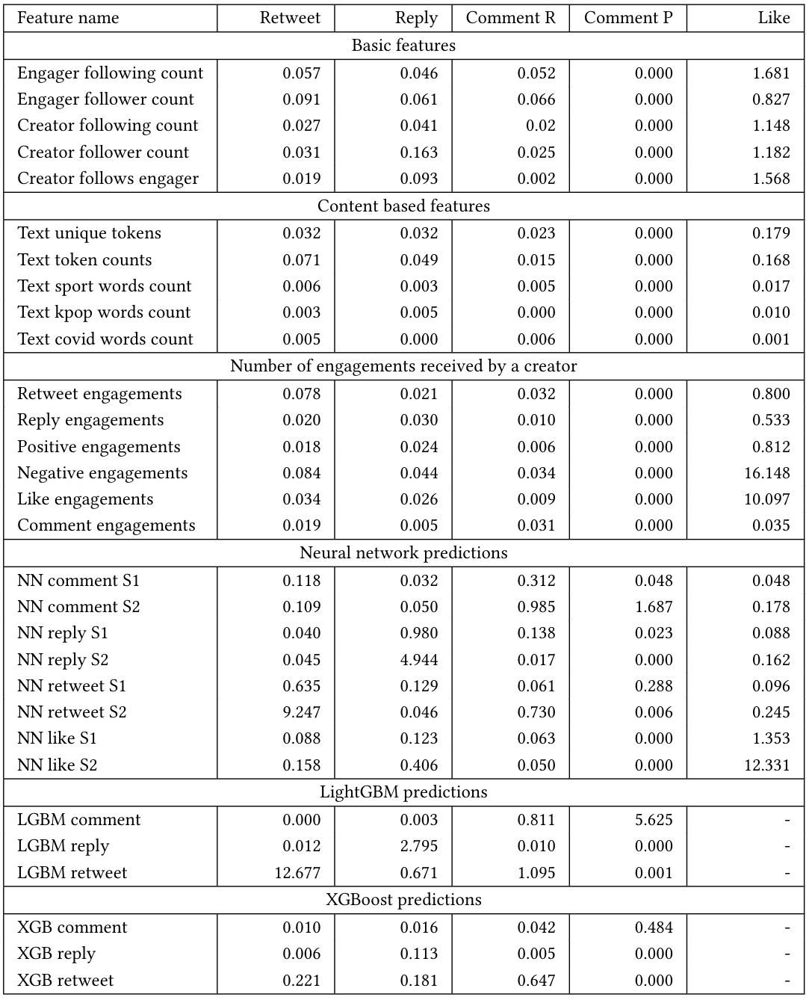

# ACM RecSys Challenge 2020
<p align="center">
  
</p>
<p align="center">
    
</p>
<p align="center">
    
</p>

## About the challenge
From the [Challenge](https://recsys-twitter.com/) website: "[Twitter](https://www.twitter.com) is what’s happening in the world and what people are talking about right now.
On Twitter, live comes to life as conversations unfold, showing you all sides of the story. From breaking news and 
entertainment to sports, politics and everyday interests, when things happen in the world, they happen first on Twitter."

"On the platform, users post and engage with (in the form of Likes, Replies, Retweets and Retweets with comments) content
known as “Tweets”. This challenge aims to evaluate novel algorithms for predicting different engagement rates at a
large scale, and push the state-of-the-art in recommender systems. Following the success and advancements in the
domain of top-K recommendations, the challenge aim to encourage the development of new approaches by releasing the largest
real-world dataset to predict user engagements. The dataset comprises of roughly 200 million public engagements,
along with user and engagement features, that span a period of 2 weeks and contain public interactions
(Like, Reply, Retweet and Retweet with comment), as well as 100 million pseudo negatives which are randomly
sampled from the public follow graph. While sampling the latter pool of Tweets, Twitter takes special care about
preserving user privacy."

## Team members
We participated in the challenge as BanaNeverAlone, a team of 5 MSc students from Politecnico di Milano:

* **[Luca Conterio](https://github.com/luca-conterio)**
* **[Andrea Donati](https://github.com/AndreaDonati)**
* **[Luca Bartoccioni](https://github.com/LucaBartoccioni)**
* **[Nicolò Felicioni](https://github.com/ciamir51)**
* **[Davide Yi Xian Hu](https://github.com/DragonBanana)**

We worked under the supervision of two PhD students:
* **[Cesare Bernardis](https://github.com/cesarebernardis)**
* **[Maurizio Ferrari Dacrema](https://github.com/maurizioFD)**

## Paper
The article describing the approach we adopted is available [here](Paper/Multi_Objective_Blended_Ensemble_appendix.pdf) (under review).

## Features

The features extracted from the dataset are listed and 
described [here](Utils/Data/Features/README.md) (the list contains all the most relevant features we created, including some
we did not use for the submission).

## Models

This repository uses:
* **XGBoost**: an optimized distributed gradient boosting library designed to be highly efficient, flexible and portable.
* **LightGBM**: LightGBM is a gradient boosting framework that uses tree based learning algorithms. It is designed to be distributed and efficient.
* **PyTorch**: PyTorch is a Python package that provides two high-level features: tensor computation (like NumPy) with 
strong GPU acceleration, and deep neural networks built on a tape-based autograd system.

## Requirements
In order to run the code it is necessary to have:
* **Python**: version 3.8. 
* **Pip**: version 20.1.1.
* **CUDA** is also required.

If you do not have Python already installed, you can find it here: https://www.python.org/downloads/.

Install the python dependecies with the following bash command:
```shell script
pip install -r requirements.txt
```

If you do not have the dataset, you can download it from here: https://recsys-twitter.com/data/show-downloads (registration is required).

After the dataset has been downloaded (without modifying the file names) and placed in the repository folder, you can use the following script to compress and move the dataset in the right folder.
```shell script
chmod +x compress_dataset.sh
./compress_dataset.sh
```

## Run the code

Split the training set into **holdout_new_train.csv.gz** and **holdout_new_test.csv.gz**.

```shell script
cp ./Utils/Data/Split/HoldoutSplit.py .
python HoldoutSplit.py
```
 
Split the resulting training set into **cherry_train.csv.gz** and **cherry_val.csv.gz**.

```shell script
cp ./Utils/Data/Split/HoldoutCherrySplit.py .
python HoldoutCherrySplit.py
```

Train the neural network:
```shell script
chmod +x nn_run.sh
./nn_run.sh
```
this script trains a bunch of NNs and places the infered probabilities in the folder "**./Dataset/Features/{dataset_name}/ensembling**" with filename "**nn_predictions_{class_label}_{model_id}.csv**"

For our last submissions please use:
```shell script 
# RUN 1 - submission last_test_sub
cp ./Blending/last_test_sub/* .
python last_blending_sub_comment.py comment
python last_blending_sub_like.py like
python last_blending_sub_retweet.py retweet
python last_blending_sub_reply.py reply
```

```shell script 
# RUN 2 - submission last_test_sub_2
cp ./Blending/last_test_sub_2/* .
python last_blending_sub_comment.py comment
python last_blending_sub_like.py like
python last_blending_sub_retweet.py retweet
python last_blending_sub_reply.py reply
```

## Permutation Importance
The following table reports the results of the permutation importance. 
The table is composed by 6 columns: the first one is the name of the feature and the other 5 report the Δ𝑅𝐶𝐸 obtained by the final ensemble models when the feature is permutated. We report the main feature categories, that are:
* Basic features, which are the features provided by the organizers of the Challenge.
* Content based features, which are the features we extracted from the dataset.
* Number of engagements received by a creator, which represents a user behavior feature.
* Neural network predictions, which are the predictions generated by the Neural network models.
* LightGBM predictions, which are the predictions generated by the LightGBM models.
* XGBoost predictions, which are the predictions generated by the XGboost models.

<p align="center">
    
</p>
